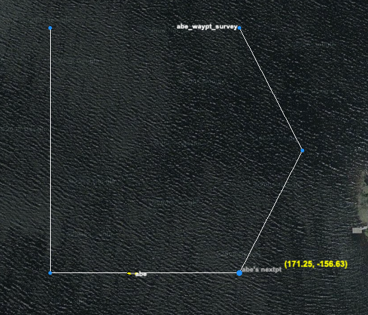

# The alpha_ufld Mission
The alpha_ufld mission is a simple starting point autonomy mission using only the waypoint behavior. The vehicle proceeds through five waypoints, posting an end flag when it is completed. 

